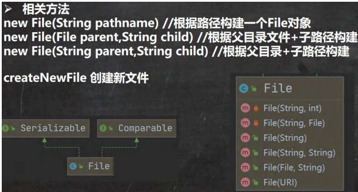

## 一、 文件操作

### 1.1 文件与文件流

- **文件**：保存数据的地方。
- **文件流**：文件在程序中以流的形式进行操作。

### 1.2 创建文件对象 (File 类)

- **构造器**：

  1. new File(String pathname)：根据路径字符串构建。  
​
2. new File(File parent, String child)：根据父目录文件对象+子路径构建。
3. new File(String parent, String child)：根据父目录字符串+子路径构建。
### 1.3 获取文件信息

- **常用方法**：

  - getName()：获取文件名。
  - getAbsolutePath()：获取文件绝对路径。
  - getParent()：获取文件父级目录。
  - length()：获取文件大小（字节）。
  - exists()：判断文件是否存在。
  - isFile()：判断是否为文件。
  - isDirectory()：判断是否为目录。

### 1.4 目录操作与文件删除

- mkdir()：创建**一级**目录。
- mkdirs()：创建**多级**目录。
- delete()：删除**空目录**或​**文件**。

## 二、 IO流原理与分类

### 2.1 原理

- I/O 指 Input/Output，用于数据传输。
- Java 程序中，数据输入/输出以  **“流 (stream)”**  形式进行。
- java.io 包提供各种流类和接口。
- **输入**：将外部数据（磁盘等）读入到程序（内存）。
- **输出**：将程序（内存）数据写出到外部设备（磁盘等）。

### 2.2 流的分类体系

1. **按操作数据单位**：

   - **字节流 (8 bit)** ：用于处理二进制文件（如图片、视频、音频）。
   - **字符流 (按字符)** ：用于处理文本文件。
2. **按数据流向**：

   - **输入流**：从数据源到程序。
   - **输出流**：从程序到目的地。
3. **按流的角色**：

   - **节点流**：直接从数据源/目的地读写数据。
   - **处理流（包装流）** ：对节点流进行包装，提供更强大的功能。

### 2.3 抽象基类与命名规律

- 所有流都派生自四个抽象基类：

|抽象基类|字节流|字符流|
| ----------| --------------| --------|
|**输入流**|InputStream|Reader|
|**输出流**|OutputStream|Writer|

- **命名规律**：子类名以其父类名作为后缀（如 FileInputStream）。

## 三、 常用节点流

### 3.1 字节输入流 FileInputStream

- **作用**：从文件读取字节数据到程序。
- **读取方式**：

  1. read()：每次读取一个字节，返回 int，到文件末尾返回 -1。
  2. read(byte[] b)：每次读取最多 b.length 个字节到字节数组，返回实际读取的字节数，到文件末尾返回 -1。

### 3.2 字节输出流 FileOutputStream

- **作用**：将程序的字节数据写入文件。
- **写入方式**：

  1. write(int b)：写入一个字节。
  2. write(byte[] b)：写入整个字节数组。
  3. write(byte[] b, int off, int len)：写入字节数组的指定部分。
- **构造器**：

  - new FileOutputStream(filePath)：覆盖写入。
  - new FileOutputStream(filePath, true)：追加写入。
- **注意**：如果文件不存在，会自动创建（前提是目录存在）。

### 3.3 字符输入流 FileReader

- **作用**：从文件读取字符数据到程序。
- **读取方式**（同 InputStream 思路，操作单位是 char）：

  1. read()：每次读取一个字符。
  2. read(char[] cbuf)：每次读取多个字符到字符数组。

### 3.4 字符输出流 FileWriter

- **作用**：将程序的字符数据写入文件。
- **写入方式**（同 OutputStream 思路）：

  1. write(int c)：写入一个字符。
  2. write(char[] cbuf) / write(String str)：写入字符数组或字符串。
  3. write(String str, int off, int len)：写入字符串的指定部分。
- **重要**​：使用 FileWriter 后，​**必须关闭流 (close())**  或 ​**刷新流 (flush())** ，数据才会真正写入文件。

## 四、 常用处理流（包装流）

### 4.1 处理流概述

- **作用**​：包装节点流，提供缓冲、便捷操作等功能，​**不直接连接数据源**。
- **优势**：

  1. **提高性能**：通过内部缓冲区减少IO次数。
  2. **操作便捷**：提供更方便的方法（如 readLine()）。
- **关闭**：只需关闭最外层的处理流，底层会自动关闭节点流。

### 4.2 缓冲流（高效）

- **BufferedReader /**  ​​**BufferedWriter**：

  - 包装字符流，提供缓冲。
  - readLine()：按行读取文本，高效便捷。
  - newLine()：写入一个行分隔符。
  - **注意**​：只能用于处理​**文本文件**。
- **BufferedInputStream /**  ​​**BufferedOutputStream**：

  - 包装字节流，提供缓冲。
  - 用于处理​**二进制文件**（如图片、音频拷贝），效率更高。

### 4.3 对象流（序列化与反序列化）

- **作用**​：保存和恢复对象的**值**和​**数据类型**。
- **ObjectOutputStream**​：提供**序列化**功能，将对象写入文件。
- **ObjectInputStream**​：提供**反序列化**功能，从文件读取对象。
- **序列化要求**：

  1. 被序列化的类必须实现 Serializable 接口（标记接口）。
  2. 建议添加 serialVersionUID 以提高版本兼容性。
  3. 序列化对象时，默认序列化所有属性（除了 static 和 transient 修饰的成员）。
  4. 序列化具有可继承性。
- **注意事项**：读写顺序必须一致。

### 4.4 转换流（解决编码问题）

- **作用**​：在字节流和字符流之间进行转换，并可以​**指定编码**。
- **InputStreamReader**：将 InputStream（字节输入流）包装成 Reader（字符输入流）。
- **OutputStreamWriter**：将 OutputStream（字节输出流）包装成 Writer（字符输出流）。
- **应用场景**：处理纯文本数据时，使用字符流效率更高，并能有效解决中文乱码问题。

### 4.5 打印流

- **PrintStream** / ​**PrintWriter**：

  - 只有输出流，没有输入流。
  - 提供了一系列重载的 print() 和 println() 方法，输出非常方便。
  - System.out 就是 PrintStream 类型。

## 五、 Properties 类

### 5.1 概述

- **Properties** 类继承自 Hashtable，是专门用于读写**配置文件**的集合类。
- **配置文件格式**​：键\=值（键值对，无需空格，值默认String类型）。

### 5.2 常用方法

- load(InputStream inStream)：从输入字节流加载属性列表（键值对）。
- list(PrintStream out)：将属性列表输出到指定打印流。
- getProperty(String key)：根据键获取值。
- setProperty(String key, String value)：设置键值对。
- store(OutputStream out, String comments)：将属性列表写入输出字节流（保存到文件）。

### 5.3 应用

- 用于读取 .properties 配置文件（如数据库连接信息）。
- 可以方便地修改和保存配置。
