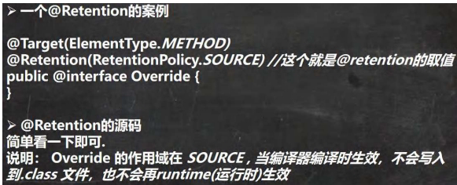
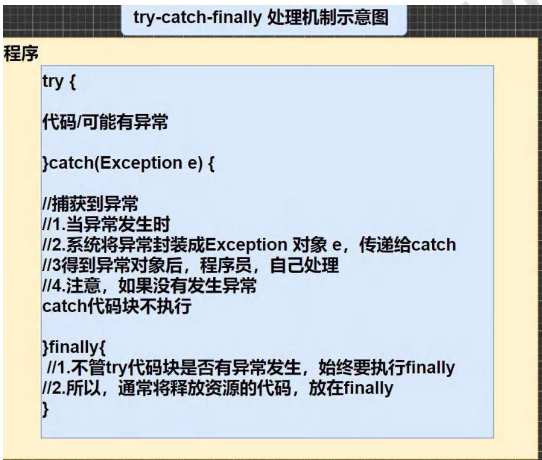

## 一、枚举 (enum)

### 1. 需求与问题分析

- ​需求​：创建季节 (Season) 对象。
    
- ​特点分析​：
    
    1. 季节的值是​有限的几个​（春、夏、秋、冬）。
    2. 这些值通常是只读的，不需要修改。
- ​传统实现的问题​：使用普通类定义，虽然可以满足，但无法从语法层面强制限制对象数量和不可变性。
    

### 2. 枚举的解决方案

- ​枚举 (Enumeration)​：是一组​常量的集合​。
- ​本质理解​：枚举是一种​特殊的类​，内部只包含一组​有限的、特定的对象​。

### 3. 枚举的两种实现方式

1. ​自定义类实现枚举​（JDK1.5之前的方式）。
2. 使用 enum​​ 关键字实现枚举​（JDK1.5引入，推荐）。

### 4. 自定义类实现枚举

- ​实现步骤（小结）​：
    
    1. ​构造器私有化​：防止外部直接 new。
    2. ​本类内部创建一组对象​：例如，创建四个 Season 对象代表四季。
    3. ​对外暴露对象​：为这些对象添加 public final static 修饰符，使其成为公共静态常量。
    4. 可以提供 get​ 方法，不提供 set​​ 方法​：保证只读性。
- ​优点​：实现了枚举的功能。
    
- ​缺点​：代码相对繁琐。
    

### 5. 使用 enum 关键字实现枚举（重点）

- ​快速入门​：使用 enum 替代 class 来定义枚举类。
- ​语法示例​：

```java
enum Season2 {
    // 1. 将常量对象定义在枚举类的行首，多个常量用逗号间隔，最后用分号结尾。
    SPRING("春天", "温暖"),
    WINTER("冬天", "寒冷"),
    AUTUMN("秋天", "凉爽"),
    SUMMER("夏天", "炎热"); // What() 如果有无参对象，也可以定义

    // 2. 定义属性
    private String name;
    private String desc;

    // 3. 构造器私有化
    private Season2(String name, String desc) {
        this.name = name;
        this.desc = desc;
    }
    // 可以提供无参构造器
    private Season2() {}
    // ... get方法
}
```

- ​注意事项​：
    
    1. 使用 enum 关键字定义的枚举类，默认隐式继承 java.lang.Enum​​ 类​，且是一个 final 类（可用 javap 反编译验证）。
    2. 传统的 public static final Season2 SPRING = new Season2("春天", “温暖”); 简化为 SPRING(“春天”, “温暖”)。它调用的是对应的构造器。
    3. 如果使用无参构造器创建枚举对象，则实参列表和小括号都可以省略，例如：BOY, GIRL;。
    4. 枚举对象必须放在枚举类的​行首​。

### 6. enum 常用方法（继承自 Enum 类）

|方法名|说明|
|---|---|
|toString()|返回当前枚举对象名。Enum类已重写，子类可重写以返回更友好的信息。|
|name()|返回当前枚举对象名（常量名）。​不能重写​。|
|ordinal()|返回当前枚举对象的​序号​（从0开始）。|
|values()|返回该枚举类中所有的常量构成的​数组​（静态方法，由编译器生成）。|
|valueOf(String name)|将字符串转换为对应的枚举对象。​字符串必须为已有常量名​，否则报 IllegalArgumentException。|
|compareTo(Enum o)|比较两个枚举常量的序号（编号）。|

### 7. enum 实现接口

- 枚举类​不能继承其他类​（因为已隐式继承 Enum，Java是单继承）。
- 但枚举类可以​实现一个或多个接口​。
- ​形式​：enum 类名 implements 接口1, 接口2 { ... }
- 可以在枚举类中统一实现接口方法，也可以让每个枚举对象单独实现接口方法（体现枚举对象之间的差异性）。

---

## 二、注解 (Annotation)

### 1. 注解的理解

- ​注解​：也被称为​元数据 (Metadata)​，用于修饰解释包、类、方法、属性、构造器、局部变量等数据信息。
    
- ​与注释的区别​：注释是给人看的，注解是给编译器或JVM等工具看的，可以被编译或运行，是嵌入代码中的补充信息。
    
- ​作用​：
    
    - ​JavaSE​：标记过时功能、忽略警告等。
    - ​JavaEE​：配置应用程序，代替繁琐的代码和XML配置（非常重要）。

### 2. 三个基本的 Annotation（必须掌握）

使用 @ 符号，将其当成修饰符使用。

#### 1) @Override

- ​作用​：限定某个方法是​重写父类方法​。只能用于方法。
    
- ​使用说明​：
    
    - 如果写了 @Override，编译器会​检查该方法是否真的重写了父类方法​。是则通过，否则报错。
    - 如果不写，但实际构成了重写，程序也能运行。但写上可以提高代码可读性和安全性。
    - 只能修饰方法。
- ​源码分析​：
    

```java
@Target(ElementType.METHOD) // 表示只能修饰方法
@Retention(RetentionPolicy.SOURCE) // 作用范围：源码阶段，编译后就不存在了
public @interface Override {
}
```

#### 2) @Deprecated

- ​作用​：表示某个程序元素（类、方法、字段等）​已过时​。不推荐使用，但仍可使用。
    
- ​使用说明​：
    
    - 可以修饰方法、类、字段、包、参数等。
    - 通常用于​版本兼容和过渡​。
- ​源码分析​：
    

```java
@Target(value={CONSTRUCTOR, FIELD, LOCAL_VARIABLE, METHOD, PACKAGE, PARAMETER, TYPE})
@Retention(RetentionPolicy.RUNTIME) // 运行时仍保留
@Documented // 会被 javadoc 工具提取
public @interface Deprecated { ... }
```

#### 3) @SuppressWarnings

- ​作用​：​抑制编译器警告​。
    
- ​使用说明​：
    
    - 可以放置的具体位置有：类、字段、方法、参数、构造器、局部变量。
    - 其作用范围与放置的位置相关（例如放在方法上，则抑制该方法内的警告）。
    - 需要指定要抑制的警告类型，例如：

```java
@SuppressWarnings({“rawtypes”, “unchecked”, “unused”})
```

### 3. JDK 的元注解 (Meta-Annotation)

元注解是用于修饰其他注解的注解。了解即可，主要用于阅读源码。

#### 1) @Retention

- ​作用​：指定被修饰的注解可以​保留多长时间​（即生命周期）。必须指定 value 值。
    
- ​三种取值​：
    
    - RetentionPolicy.SOURCE：编译器使用后直接丢弃（如 @Override）。



- RetentionPolicy.CLASS：编译器记录在 .class 文件中，但JVM运行时不会保留（​默认值​）。
- RetentionPolicy.RUNTIME：编译器记录在 .class 文件中，JVM运行时保留，​程序可以通过反射获取​（如 @Deprecated）。

#### 2) @Target

- ​作用​：指定被修饰的注解能用于修饰哪些​程序元素​（如方法、类、字段等）。
- 常见 ElementType​​ 取值​：TYPE(类/接口), FIELD, METHOD, PARAMETER, CONSTRUCTOR, LOCAL_VARIABLE, ANNOTATION_TYPE(注解)等。

#### 3) @Documented

- ​作用​：指定被修饰的注解将被 javadoc 工具提取成文档。

#### 4) @Inherited

- ​作用​：被修饰的注解将具有​继承性​。如果父类使用了该注解，其子类将自动具有该注解。
- ​注意​：实际应用较少。

## 三、异常引入与基本概念

### 1. 问题引入

- 运行包含错误逻辑的代码（如除数为零）会导致程序​崩溃并终止​。
- ​目标​：通过异常处理机制，捕获并处理错误，使程序能够继续运行或优雅地结束。

### 2. 异常介绍

- ​异常​：程序执行过程中发生的​不正常情况​（语法错误和逻辑错误不属于异常）。
    
- ​异常体系两大类别​：
    
    1. ​Error（错误）​：Java虚拟机无法解决的严重问题，如StackOverflowError（栈溢出）、OutOfMemoryError（OOM）。程序会崩溃，通常无法通过代码处理。
        
    2. ​Exception（异常）​：因编程错误或偶然外在因素导致的一般性问题，可以使用针对性代码进行处理。分为两大类：
        
        - ​运行时异常（RuntimeException）​：程序运行时发生的异常，编译器不强制检查。
        - ​编译时异常​：编译器要求必须进行处理的异常（如IOException）。

### 3. 异常体系图（重要）

```
Throwable
├── Error (e.g., StackOverflowError, OutOfMemoryError)
└── Exception
    ├── RuntimeException (运行时异常)
    │   ├── NullPointerException
    │   ├── ArithmeticException
    │   ├── ArrayIndexOutOfBoundsException
    │   ├── ClassCastException
    │   └── NumberFormatException
    └── 其他Exception (编译时异常，e.g., IOException, SQLException)
```

- ​小结​：
    
    - 运行时异常编译器不检查，通常由逻辑错误引起，程序员应尽量避免。
    - 编译时异常编译器强制要求处理，否则编译不通过。

## 四、常见异常详解

### 1. 常见运行时异常（RuntimeException）

|异常类型|触发场景|
|---|---|
|NullPointerException|试图在需要对象的地方使用 null（如调用 null 对象的方法或属性）。|
|ArithmeticException|出现异常的运算条件（如整数“除以零”）。|
|ArrayIndexOutOfBoundsException|用非法索引（负索引或大于等于数组长度）访问数组。|
|ClassCastException|试图将对象强制转换为不是其实例子类的类型。|
|NumberFormatException|试图将格式不正确的字符串转换为数值类型（如 Integer.parseInt(“abc”)）。|

### 2. 编译时异常

- ​特点​：编译期间就必须处理，否则代码无法通过编译。
- ​常见类型​：SQLException、IOException、FileNotFoundException、ClassNotFoundException 等。
- ​说明​：由于涉及后续章节知识（如文件、数据库操作），此处仅作概念了解。

## 五、异常处理机制

### 1. 处理方式

1. ​try-catch-finally​：程序员在代码中捕获发生的异常，并自行处理。

​

2. ​throws​：将发生的异常​抛出​，交给方法的调用者处理，最终可交给JVM。

### 2. try-catch-finally 处理

- ​基本语法​：

```java
try {
    // 可能发生异常的代码
} catch (ExceptionType e) {
    // 捕获到异常后的处理逻辑
    // e.getMessage(): 获取异常信息
} finally {
    // 无论是否发生异常，都会执行的代码（通常用于释放资源）
}
```

- ​注意事项与细节​：
    
    1. 如果异常发生，异常行之后的 ​try 块内代码不会执行​，直接跳入对应的 catch 块。
    2. 如果异常未发生，则顺序执行完 try 块，跳过 catch 块。
    3. finally 块中的代码​必定执行​（即使 catch 块中有 return 语句）。
    4. 可以有​多个 catch 块​，捕获不同类型的异常并进行不同处理。​必须遵循：子类异常在前，父类异常在后​（例如 NullPointerException 在 Exception 之前）。
    5. 可以进行 try-finally 配合使用（无 catch）。这种用法​不捕获异常​，程序遇到异常仍会崩溃，但 finally 块会执行。适用于“无论是否异常，都必须执行某段逻辑（如关闭资源）”的场景。
- ​执行顺序小结​：
    
    - ​无异常​：执行 try → [跳过 catch] → finally。
    - ​有异常​：执行 try (到异常处) → 匹配的 catch → finally。

### 3. throws 异常处理

- ​基本介绍​：在方法声明处，用 throws 语句声明该方法可能抛出的异常类型，将异常的处理责任​传递给该方法的调用者​。
    
- ​语法​：访问修饰符 返回类型 方法名(参数列表) throws 异常类型1, 异常类型2 { ... }
    
- ​注意事项与细节​：
    
    1. 对于​编译时异常​，程序中必须处理（要么 try-catch，要么 throws）。
    2. 对于​运行时异常​，程序中如果没有处理，默认就是 throws​ 的方式向上抛出。
    3. ​子类重写父类方法时​，对抛出异常的规定：子类重写方法所抛出的异常类型，​必须和父类抛出异常一致，或者是其子类​。
    4. 在某个方法内，如果已经用 try-catch 处理了异常，则相当于处理完毕，可以不必再 throws。

## 六、自定义异常

### 1. 基本概念

当程序中出现特定的错误，但Java标准异常类中没有合适的异常来描述时，可以​自定义异常类​。

### 2. 步骤

1. 定义类，类名自定义，继承 Exception​​ 或 RuntimeException​。
    
    - 继承 Exception → ​编译时异常​（使用时必须处理）。
    - 继承 RuntimeException → ​运行时异常​（推荐，更灵活）。
2. 通常提供两个构造器：一个无参构造器，一个带 String message 参数的构造器（用于传递异常信息）。
    

### 3. 应用实例

例如，定义 AgeException，在接收年龄参数时，若范围不在 18-120 之间，则抛出此自定义异常。

```java
class AgeException extends RuntimeException {
    public AgeException(String message) {
        super(message);
    }
}
// 使用
if(age < 18 || age > 120) {
    throw new AgeException("年龄需要在 18~120 之间");
}
```

## 七、throw 与 throws 的区别（重要）

|关键词|意义|位置|后面跟随的东西|
|---|---|---|---|
|throws|​异常处理的一种方式​（声明可能抛出的异常）|方法声明处|​异常类型​（可以是多个）|
|throw|手动生成异常对象并抛出的关键字|方法体内|​异常对象​（new Exception(...)）|

​简单记忆​：throws 是声明异常，throw 是抛出异常。