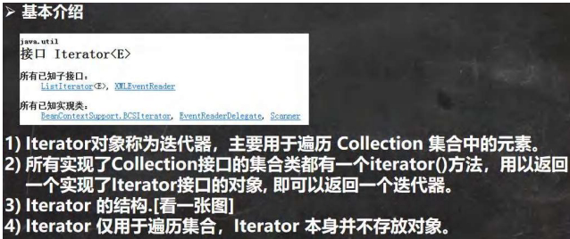
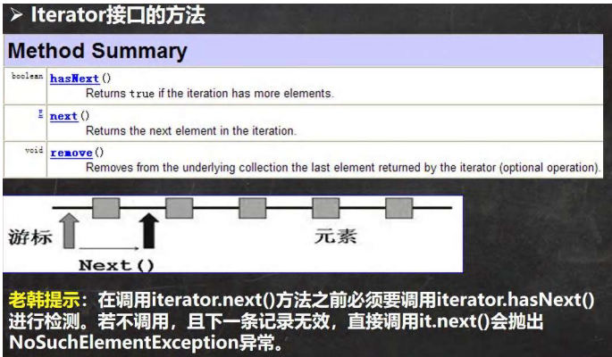
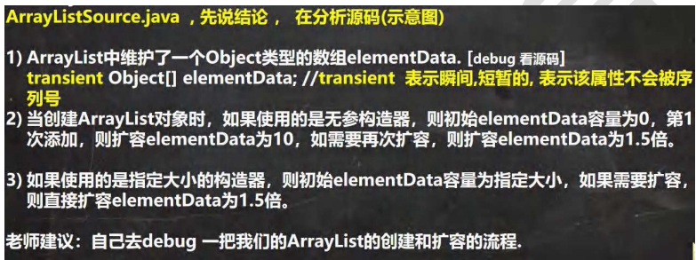

## 一、 集合概述

### 1.1 集合的好处 (相比数组)

- **动态保存**：可以保存任意多个对象，长度可变。
- **丰富API**：提供了一系列方便操作对象的方法，如 add, remove, set, get 等。
- **代码简洁**：使用集合进行增删改查比数组更简洁。
### 1.2 集合框架体系 (两大主线)

Java集合主要分为两大类：**单列集合** (Collection) 和 **双列集合** (Map)。
- **Collection** **接口**：存放单个对象。
    - 有两个重要子接口：List 和 Set。
    - List：有序、可重复。
        - 主要实现类：ArrayList, LinkedList, Vector。
    - Set：无序、不可重复。
        - 主要实现类：HashSet, LinkedHashSet, TreeSet。
- **Map** **接口**：存放键值对 K-V。
    - 主要实现类：HashMap, Hashtable, TreeMap, LinkedHashMap, Properties。
## 二、 Collection 接口

### 2.1 Collection 接口特点

1. 可以存放多个元素，每个元素是 Object。
2. 有些实现类可存放重复元素 (List)，有些不可以 (Set)。
3. 有些是有序的 (List)，有些不是 (Set)。
4. Collection 接口没有直接实现类，通过其子接口 Set 和 List 实现。
### 2.2 Collection 接口遍历元素方式

1. **使用 Iterator 迭代器**
    - 所有实现了 Collection 接口的集合都有一个 iterator() 方法，返回迭代器对象。
        

- 迭代器仅用于遍历，本身不存放对象。
- **执行原理**：hasNext() 判断是否还有下一个元素，next() 下移并返回元素。

- **注意**：在调用 next() 之前必须调用 hasNext() 检测，否则可能抛出 NoSuchElementException。
6. **增强 for 循环**
    - 本质就是迭代器的简化版，语法更简洁。
    - 只能用于遍历集合或数组。
    - 语法：for(元素类型 元素名 : 集合名或数组名) { //访问元素 }
## 三、 List 接口

### 3.1 List 接口特点

1. **有序**：添加顺序和取出顺序一致。
2. **可重复**：允许存放相同的元素。
3. **支持索引**：每个元素都有其对应的顺序索引 (0-based)，可以通过 get(int index) 方法获取。
### 3.2 List 接口常用方法

- add(int index, Object ele)：在 index 位置插入 ele 元素。
- addAll(int index, Collection eles)：从 index 位置开始将 eles 中的所有元素添加进来。
- get(int index)：获取指定 index 位置的元素。
- indexOf(Object obj)：返回 obj 在集合中首次出现的位置。
- lastIndexOf(Object obj)：返回 obj 在集合中末次出现的位置。
- remove(int index)：移除指定 index 位置的元素，并返回此元素。
- set(int index, Object ele)：设置指定 index 位置的元素为 ele，相当于替换。
- subList(int fromIndex, int toIndex)：返回从 fromIndex 到 toIndex 位置的子集合（前闭后开）。

### 3.3 List 的三种遍历方式

1. 迭代器 Iterator
2. 增强 for 循环
3. 普通 for 循环（利用索引）
## 四、 List 接口实现类

### 4.1 ArrayList

- **底层结构**：可变长度的对象数组 Object[] elementData。
- **线程安全**：**线程不安全**，但执行效率高。
- **扩容机制**：
    - **无参构造器**：初始容量为0，第一次添加扩容至10，后续需要扩容时，按当前容量的1.5倍扩容。
    - **有参构造器**：初始容量为指定大小，后续需要扩容时，同样按1.5倍扩容。
- **其他**：可以加入 null，且允许多个。
### 4.2 Vector

- **底层结构**：对象数组 Object[] elementData。

- **线程安全**：**线程安全**（方法带有 synchronized 关键字），但效率较低。
- **扩容机制**：
    - **无参构造器**：默认初始容量10，满后按2倍扩容。
    - **有参构造器**：初始容量为指定大小，满后按2倍扩容。
- **与 ArrayList 比较**

|           | 底层结构 | 版本     | 线程安全 | 效率  | 扩容倍数                     |
| --------- | ---- | ------ | ---- | --- | ------------------------ |
| ArrayList | 可变数组 | JDK1.2 | 不安全  | 高   | 无参：首次10，后续1.5倍；有参：直接1.5倍 |
| Vector    | 可变数组 | JDK1.0 | 安全   | 不高  | 无参：默认10，满后2倍；有参：满后2倍     |

### 4.3 LinkedList

- **底层结构**：**双向链表**。维护了属性 first 和 last 分别指向首尾节点。每个节点 (Node) 有 prev, item, next 属性。
- **特点**：实现了双向链表和双端队列接口。可以添加任意元素（包括 null）。线程不安全。
- **操作机制**：元素的添加和删除通过操作链表完成，不涉及数组扩容，因此**增删效率高，改查效率低**。
- **与 ArrayList 比较**

|            | 底层结构 | 增删效率     | 改查效率 |
| ---------- | ---- | -------- | ---- |
| ArrayList  | 可变数组 | 较低（数组扩容） | 较高   |
| LinkedList | 双向链表 | 较高（链表追加） | 较低   |
## 五、 Set 接口

### 5.1 Set 接口特点

1. **无序**（添加和取出顺序不一致，但 LinkedHashSet 和 TreeSet 除外）。
2. **不允许重复元素**，最多包含一个 null。
3. **没有索引**，不能使用普通 for 循环遍历。
4. **遍历方式**：迭代器、增强 for 循环。
### 5.2 HashSet

- **底层结构**：**HashMap**。即底层是 数组 + 链表 + 红黑树。
- **添加机制**（去重核心）：
    1. 添加元素时，先得到 hash 值，然后转成索引值。
    2. 找到存储数据表 table，看索引位置是否已有元素。
    3. 如果没有，直接加入。
    4. 如果有，调用 equals 比较：
        - 如果相同，放弃添加。
        - 如果不同，则添加到链表的最后（或树化）。
30. **扩容与树化**：
    - 第一次添加时，table 扩容到16，临界值 (threshold) 为 16 * 0.75 = 12。
    - 如果 table 使用到临界值，就扩容到 当前容量 * 2，临界值也相应更新。
    - **树化**：当一条链表的元素个数达到 TREEIFY_THRESHOLD (默认8)，并且 table 的大小 >= MIN_TREEIFY_CAPACITY (默认64)，该链表会转为红黑树，否则仍采用数组扩容。
### 5.3 LinkedHashSet

- **底层结构**：**LinkedHashMap**。是 HashSet 的子类。
- **特点**：在 HashSet 数组+链表/红黑树的基础上，增加了一套**双向链表**，用于维护元素的添加顺序。这使得元素看起来是以插入顺序保存的。
- **优点**：既拥有了 HashSet 的去重能力，又能保证遍历顺序与插入顺序一致。
### 5.4 TreeSet

- **底层结构**：**TreeMap**（红黑树）。
- **排序/去重机制**：
    1. **传入比较器 (****Comparator****)**：使用构造器传入的 Comparator 对象的 compare 方法进行排序和去重。返回0则认为相同，不添加。
    2. **未传入比较器**：则使用添加对象实现的 Comparable 接口的 compareTo 方法去重。如果对象没有实现 Comparable，添加时会抛出 ClassCastException。
## 六、 Map 接口

### 6.1 Map 接口特点

1. Map 与 Collection 并列存在，用于保存具有**映射关系**的数据 Key-Value。
2. Key 和 Value 可以是任何引用类型数据，封装在 HashMap$Node 对象中。
3. Key **不允许重复**（原因同 HashSet），Value 可以重复。
4. Key 可以为 null（仅一个），Value 可以为 null（多个）。
5. 常用 String 类作为 Map 的 Key。
6. Key 和 Value 是单向一对一关系，通过指定的 Key 总能找到对应的 Value。
### 6.2 Map 接口遍历方式

1. **keySet()**：获取所有 Key 的 Set 集合，然后通过 get(key) 获取 Value。
2. **values()**：获取所有 Value 的 Collection 集合。
3. **entrySet()**：获取所有 Entry (K-V 对) 的 Set 集合。然后可以从 Entry 对象中获取 getKey() 和 getValue()。
### 6.3 HashMap

- **使用频率最高的** **Map** **实现类**。
- **线程不安全**，方法未同步。
- **底层机制**：数组 + 链表 + 红黑树。
- **扩容机制**：与 HashSet 完全相同（因为 HashSet 底层就是 HashMap）。
    - 首次扩容到16，临界值12。
    - 后续扩容为2倍，临界值 = 新容量 * 0.75。
    - 树化条件：链表长度 >= 8 且 数组长度 >= 64。
- **添加/替换机制**：添加相同的 Key 会覆盖原来的 Value，等同于修改。
### 6.4 Hashtable

- **线程安全**的 Map 实现类（方法使用 synchronized 修饰），效率较低。
- **键和值都不能为** **null**，否则抛出 NullPointerException。
- **与 HashMap 比较**：

|           | 版本     | 线程安全 | 效率  | 允许null键值 |
| --------- | ------ | ---- | --- | -------- |
| HashMap   | JDK1.2 | 不安全  | 高   | 可以       |
| Hashtable | JDK1.0 | 安全   | 较低  | 不可以      |
### 6.5 Properties

- 继承自 Hashtable 并实现了 Map 接口。
- 同样使用 K-V 结构，**键和值也不能为** **null**。
- 通常用于从 .properties 配置文件中加载数据，在IO流中常用。
## 七、 Collections 工具类

### 7.1 介绍

Collections 是一个操作 Set、List 和 Map 等集合的**工具类**，提供了一系列静态方法。
### 7.2 常用方法

- **排序操作**：
    - reverse(List)：反转顺序。
    - shuffle(List)：随机排序。
    - sort(List)：自然排序（升序）。
    - sort(List, Comparator)：定制排序。
    - swap(List, int, int)：交换元素。
- **查找、替换**：
    - max(Collection) / min(Collection)：返回最大/最小元素。
    - max(Collection, Comparator) / min(Collection, Comparator)：定制比较返回最大/最小。
    - frequency(Collection, Object)：返回指定元素出现次数。
    - copy(List dest, List src)：将 src 内容复制到 dest。
    - replaceAll(List list, Object oldVal, Object newVal)：使用新值替换所有旧值。
## 八、 开发中选择集合实现类的建议

- **单列情况**：
    - 需要**唯一元素** -> Set
        - 需要**顺序** -> TreeSet (排序) 或 LinkedHashSet (插入顺序)。
        - 不需要顺序 -> HashSet。
    - 允许**重复元素** -> List
        - 增删多 -> LinkedList。
        - 查改多 -> ArrayList。
    - 不确定情况 -> ArrayList。
- **双列情况 (键值对)**：
    - -> Map
        - 需要排序 -> TreeMap。
        - 不需要排序，但需要保持插入或访问顺序 -> LinkedHashMap。
        - 其他情况 -> HashMap。
- **线程安全**：
    - 需要线程安全 -> 使用 Collections.synchronizedXXX() 包装，或考虑 ConcurrentHashMap (对于 Map)。