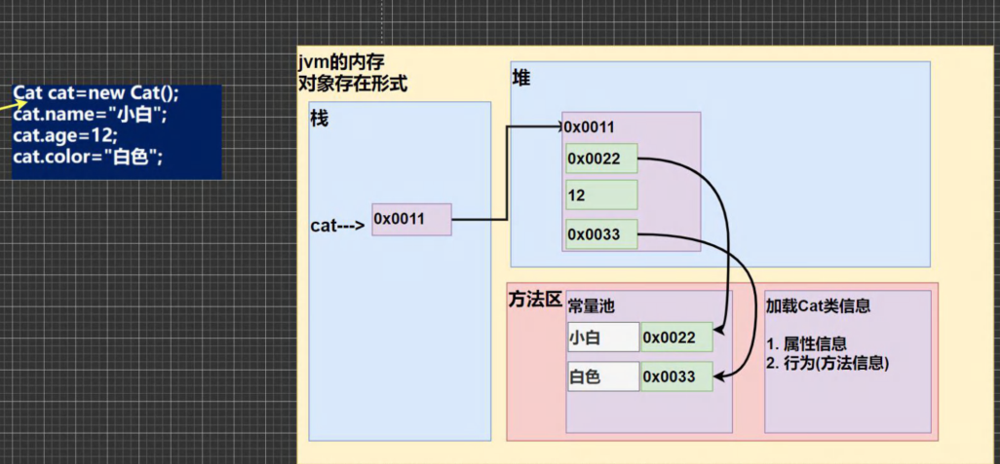
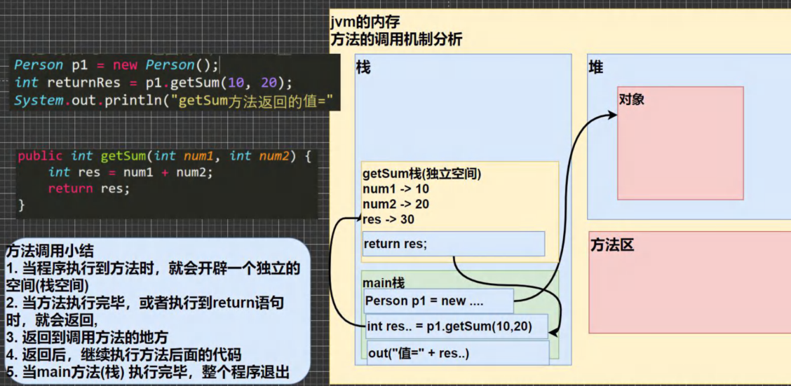

## 一、面向对象与类、对象概述

- ​**核心思想**​：​**面向对象编程 (OOP)** ​。将现实世界的事物抽象为程序中的​**对象**​，每个对象包含​**属性（状态）和行为（方法）** 。
- ​**程序世界**：一个程序就是一个由许多对象构成的世界。

### 类与对象的关系

- ​**类 (Class)** ：

  - 抽象的、概念上的定义，代表一类事物（如“猫类”、“人类”）。
  - 是​**对象的模板/数据类型**​，定义了该类对象共有的**属性**和​**行为**。
- ​**对象 (Object) / 实例 (Instance)** ：

  - 具体的、实际存在的个体，是类的一个具体例子（如“一只叫小白3岁的猫”、“一个叫老韩的人”）。
- ​**关系**​：​**类是对象的抽象，对象是类的实例**。必须先有类，才能创建对象。

### 对象在内存中的存在形式（重要！）

1. ​**栈**：存放局部变量等（如对象引用 cat1）。
2. ​**堆**：存放对象本身（属性数据）。
3. ​**方法区**：存放类的信息（属性结构、方法代码）、常量池。

- ​**创建流程**​：Cat cat1 \= new Cat();

  1. ​**加载类信息**：JVM将Cat类的属性、方法信息加载到方法区（只加载一次）。
  2. ​**堆中分配空间**​：在堆中开辟内存，存放Cat对象的属性，并进行​**默认初始化**（如int为0，String为null）。
  3. ​**建立引用**：将堆中对象的地址（如0x0011）赋给栈中的引用变量cat1。
  4. ​**指定初始化**​：执行cat1.name \= “小白”等语句，为属性赋具体值。

###  属性 / 成员变量 / 字段

- ​**概念**​：属性是类的一个组成部分，表示对象的状态或数据。成员变量 \= 属性 \= 字段 (field)。
- ​**定义语法**：访问修饰符 属性类型 属性名; （如 public String name;）
- ​**注意事项**：

  1. 属性可以是任意类型（基本类型或引用类型如数组、对象）。
  2. 属性若不赋值，有默认值（规则同数组：int 0, double 0.0, boolean false, 引用类型 null）。

### 类和对象的内存分配机制

- ​**基本数据类型赋值**​：传递的是​**值本身**​。int a \= 10; int b \= a; 修改b不影响a。
- ​**引用数据类型赋值**​：传递的是对象在​**堆中的地址**。

```java
Person p1 = new Person();
p1.age = 10;
Person p2 = p1; // p2 指向 p1 所指向的同一个对象
System.out.println(p2.age); // 10
p2.age = 20;
System.out.println(p1.age); // 20 (因为指向同一对象)
```

## 二、成员方法

### 1. 为什么需要成员方法

- 对象不仅有属性（状态），还有行为（功能）。方法用于封装对象的行为。
- ​**好处**：

  1. ​**提高代码复用性**：将常用功能封装成方法，多处调用。
  2. ​**实现细节封装**：使用者只需调用方法，无需关心内部实现。

### 2. 成员方法的定义与调用

原理（重要！）：


- ​**定义语法**：

```java
访问修饰符 返回数据类型 方法名(形参列表) {
    // 方法体
    语句;
    return 返回值; // 如果返回类型不是void
}
```

### 3. 方法传参机制（非常重要！）

- ​**基本数据类型传参**​：传递的是​**值的拷贝**​。形参的改变**不会影响**实参。

```java
public void swap(int a, int b) { // a, b 是实参值的拷贝
    int tmp = a; a = b; b = tmp; // 交换只发生在方法内部
}
// main: swap(x, y); 调用后 x, y 不变
```

- ​**引用数据类型传参**​：传递的是​**地址的拷贝**​。形参和实参指向​**同一个对象**。通过形参修改对象属性，会影响实参指向的对象。

```java
public void test100(int[] arr) { arr[0] = 200; } // 修改会影响原数组
public void test200(Person p) { p.age = 10000; } // 修改会影响原对象
```

- ​**注意**​：如果在方法内让形参引用指向一个​**新的对象**​（p \= new Person();）或null，则不会影响实参的指向。

### 4. 方法递归调用

- **概念**：方法自己调用自己，每次调用传入不同的变量。
- **能解决的问题**：数学问题（阶乘、斐波那契数列）、迷宫、汉诺塔、八皇后、各种算法（快排、二分查找）等。
- **重要规则**：

  1. 每次调用都会开辟新的栈空间，局部变量独立。
  2. 如果方法中使用引用类型变量，则会共享该数据。
  3. **必须向退出递归的条件逼近**，否则会无限递归导致栈溢出 (StackOverflowError)。
  4. 谁调用，结果就返回给谁。
- 

### 5. 方法重载 (OverLoad)

- ​**概念**​：在同一个类中，允许存在多个​**同名方法**​，但要求它们的​**形参列表不一致**（类型、个数、顺序至少有一项不同）。
- ​**好处**：减轻起名和记名的麻烦。
- ​**细节**：

  1. 方法名必须相同。
  2. 形参列表必须不同。**返回类型、参数名称**无要求。
- ​**判断**：void show(int a, char b, double c) {}

  - 重载：void show(int a, double c, char b){} (顺序不同)
  - 不重载：void show(int x, char y, double z){} (仅参数名不同，不算)

### 6. 可变参数

- ​**概念**：将同一个类中多个同名同功能但参数个数不同的方法，封装成一个方法。
- ​**语法**：访问修饰符 返回类型 方法名(数据类型... 形参名) {}
- ​**细节**：

  1. 实参可以为0个到任意多个。
  2. 可变参数的实参可以是数组。
  3. ​**本质就是数组**。
  4. 可变参数必须放在形参列表的​**最后**，且一个形参列表只能有一个可变参数。

```java
public int sum(int... nums) { // nums 可当作数组使用
    int res = 0;
    for(int i = 0; i < nums.length; i++) { res += nums[i]; }
    return res;
}
```

## 三、作用域

### 1. 基本概念

- ​**全局变量（属性）** ：作用域为整个类体，可以被本类方法使用，也可通过对象被其他类使用。有默认值，生命周期长（伴随对象）。
- ​**局部变量**：作用域在定义它的代码块（如方法、循环体内）内。必须赋值后才能使用，无默认值。生命周期短（伴随代码块执行）。

### 2. 注意事项

1. ​**属性和局部变量可以重名**​，访问时遵循​**就近原则**。
2. 同一作用域内（如一个方法内），局部变量不能重名。
3. ​**修饰符**：属性可以加public、private等修饰符，局部变量不能加。

## 四、构造器 / 构造方法

### 1. 为什么需要构造器

在创建对象时，直接完成对象的初始化（为属性赋初值），而不是先创建空对象再赋值。

### 2. 基本介绍

- 构造器是类的一种特殊方法，主要作用是​**完成新对象的初始化**。
- ​**特点**：

  1. 方法名必须和类名相同。
  2. ​**没有返回值**，也不能写void。
  3. 在创建对象时，系统**自动调用**相应的构造器。
- ​**语法**：[修饰符] 方法名(形参列表) { 方法体; }

### 3. 注意事项

1. 一个类可以定义多个不同的构造器（即构造器重载）。
2. 如果没有定义构造器，系统会生成一个​**默认的无参构造器**。一旦定义了自己的构造器，默认构造器就被覆盖，除非显式定义。
3. 构造器可以完成除了初始化之外的任何操作（如调用方法），但​**不推荐**。

## 五、this 关键字

### 1. 为什么需要 this

当构造器或方法的​**形参名与属性名相同时**，为了区分局部变量和属性，需要使用this。

```java
class Dog {
    String name;
    public Dog(String name) { // 形参名与属性名相同
        this.name = name; // this.name 指当前对象的属性，name 指形参
    }
}
```

### 2. 深入理解 this

- ​**this 代表当前对象**。哪个对象调用，this就指向哪个对象。
- 在方法中，可以通过 this.属性名 或 this.方法名(参数) 来访问本类的成员。

### 3. 注意事项和使用细节

1. this 可用于访问本类的​**属性、方法、构造器**。
2. 用于区分当前类的属性和局部变量。
3. 访问本类构造器语法：this(参数列表); ​**必须放在构造器的第一行**。
4. this 不能在类定义的外部使用，只能在类定义的方法中使用。

## 六、访问修饰符 (Access Modifier)

用于控制类、属性和方法的访问权限范围。

|访问级别|修饰符|同类|同包|子类|不同包|说明|
| ----------| -----------------| ------| ------| ------| --------| --------------------|
|**公开**|public|✓|✓|✓|✓|对外完全公开|
|**受保护**|protected|✓|✓|✓|✗|对子类和同包类公开|
|**默认**|(无，即default)|✓|✓|✗|✗|仅对同包的类公开|
|**私有**|private|✓|✗|✗|✗|仅本类内部可访问|

​**注意事项**：

1. public和默认(无修饰符)可以修饰​**类**。
2. 成员方法的访问规则与属性完全相同。

## 七、封装 (Encapsulation)

### 1. 封装的理解与好处

- ​**理解**：将数据和操作数据的方法封装在一起，对外隐藏实现细节。
- ​**好处**：

  1. ​**隐藏实现细节**：使用者只需关注功能，无需了解内部复杂逻辑。
  2. ​**数据验证**：可以对数据进行有效性的校验，保证数据安全合理。
  3. ​**便于维护**：内部逻辑修改不影响外部调用。

### 2. 封装的实现步骤 (三步)

1. ​**私有化属性**：将属性用private修饰。
2. **提供公共的set方法**：用于对属性进行判断和赋值。
3. **提供公共的get方法**：用于获取属性的值。

## 八、继承 (Inheritance)

### 1. 为什么需要继承？

解决多个类中存在**相同属性和方法**时的**代码复用**问题。

### 2. 继承的基本介绍与示意图

- ​**概念**：子类 (Subclass) 继承父类 (Superclass) 的属性和方法，同时可以拥有自己的特性。
- ​**语法**：class 子类 extends 父类 { }
- ​**术语**：父类（超类、基类）、子类（派生类）。

### 3. 继承的细节问题 (非常重要！)

1. ​**访问权限**​：子类继承了父类**所有**的属性和方法。但​**私有(private)成员不能在子类直接访问**，需要通过父类提供的公共方法间接访问。
2. ​**构造器调用**：

   - 创建子类对象时，**必须调用父类构造器**以完成父类初始化。
   - 默认情况下，子类构造器会**隐式调用父类的无参构造器** super()。
   - 如果父类​**没有无参构造器**​，则必须在子类构造器中**显式使用super(参数)**  指定调用父类的哪个构造器，且super(...)必须是子类构造器的​**第一条语句**。
3. ​**单继承机制**​：Java中，一个子类​**最多只能直接继承一个父类**（单继承）。
4. ​**Object类**：Java中所有类都默认继承Object类。
5. ​**super关键字**​：代表​**父类的引用**，用于访问父类的属性、方法和构造器。

   - super.属性名 / super.方法名()：访问父类的成员（不能访问private）。
   - super(参数列表)：在子类构造器中调用父类构造器。
6. ​**继承的内存布局**​：子类对象在堆中包含了父类所有属性的空间。属性查找顺序：​**子类 ->**  **父类 ->**   **... ->**  **Object**。

### 4. super 与 this 的比较

|区别点|this|super|
| --------| ------------------------| -------------------------|
|**访问属性**|从**本类**开始查找|从**父类**开始查找|
|**调用方法**|从**本类**开始查找|从**父类**开始查找|
|**调用构造器**|调用**本类**构造器 (this(...))|调用**父类**构造器 (super(...))|
|**特殊**|表示**当前对象**|在子类中访问**父类对象**|

​**注意**​：super(...)和this(...)都​**必须放在构造器第一行**，因此二者不能共存于同一个构造器中。

## 九、多态 (Polymorphism)

### 1. 多态的基本介绍

- ​**概念**​：方法或对象具有​**多种形态**。建立在封装和继承的基础之上。
- ​**体现**：

  1. ​**方法的多态**​：**重载 (Overload)**  和 ​**重写 (Override)** 。
  2. ​**对象的多态 (核心)** ​：一个对象的**编译类型**和**运行类型**可以不一致。

### 2. 对象的多态 (核心)

- ​**重要规则**：

  1. 对象的**编译类型**在定义时 (\=左边) 就确定了，不能改变。
  2. 对象的**运行类型**是可以变化的 (\=右边)。
  3. 编译时看左边，运行时看右边。

```java
Animal animal = new Dog(); // animal编译类型Animal，运行类型Dog
animal = new Cat(); // animal运行类型变为Cat，编译类型仍是Animal
```

### 3. 多态的向上转型与向下转型

- ​**向上转型**：

  - 本质：​**父类的引用指向子类的对象**。
  - 语法：父类类型 引用名 \= new 子类类型();
  - 特点：可以调用父类中的所有成员（遵守访问权限），​**不能调用子类特有成员**​；运行效果看子类的具体实现（即​**动态绑定**）。
- ​**向下转型**：

  - 本质：将**父类引用**强制转回​**子类引用**。
  - 语法：子类类型 引用名 \= (子类类型) 父类引用;
  - 前提：父类引用**必须指向**当前要转换的​**子类类型对象**。否则会抛出ClassCastException。
  - 作用：转型后可以调用子类的所有成员。
- ​**instanceof比较操作符**​：用于判断**对象的运行类型**是否为XX类型或其子类型。对象 instanceof 类名

### 4. Java的动态绑定机制 (非常重要！)

1. ​**调用对象方法时**​：该方法会和对象的**内存地址/运行类型**进行绑定。
2. ​**调用对象属性时**​：**没有**动态绑定机制，属性值取决于​**声明该属性的类型**（即编译类型）。

### 5. 多态的应用

1. ​**多态数组**：数组定义为父类类型，实际存放子类类型的对象。
2. ​**多态参数**：方法形参定义为父类类型，实参可以传入任意子类类型的对象。极大地提高了代码的复用性和扩展性。

## 十、方法重写/覆盖 (Override)

### 1. 基本介绍

子类有一个方法，和父类的某个方法的​**名称、返回类型、参数列表完全一样**​，我们就说子类的这个方法**重写 (覆盖)**  了父类的方法。

### 2. 注意事项与细节

1. 子类方法的**形参列表、方法名称**必须和父类方法完全一致。
2. 子类方法的**返回类型**必须和父类方法一样，或者是父类返回类型的​**子类**。
3. 子类方法的**访问权限**不能比父类方法更严格（即不能缩小访问范围）。例如：父类是public，子类不能是protected。
4. 子类不能重写父类的private方法。
5. ​**重写(Override) vs 重载(Overload)** ：

|名称|发生范围|方法名|形参列表|返回类型|修饰符|
| ------| ----------| ----------| ----------| --------------| ------------------|
|**重载 (Overload)**|**本类**|必须相同|**必须不同**|无要求|无要求|
|**重写 (Override)**|**父子类**|必须相同|**必须相同**|相同或其子类|不能缩小访问范围|

## 十一、Object 类详解

Object类是Java所有类的根父类。

### 1. equals 方法

- ​ **==**  **操作符**：

  - 判断​**基本类型**​：比较**值**是否相等。
  - 判断​**引用类型**​：比较**地址**是否相等（是否为同一个对象）。
- ​**equals 方法**：

  - 是Object类中的方法，只能判断​**引用类型**。
  - **默认**行为：判断**地址**是否相等 (return (this \=\= obj);)。
  - ​**子类重写**​：如String、Integer、Date等类重写了equals方法，用于判断**内容**是否相等。
  - ​**如何重写equals**：通常比较两个对象的所有属性是否都相等。

### 2. hashCode 方法

- 返回对象的哈希码值（整数），支持哈希表类（如HashMap）的高效运行。
- 两个引用指向​**同一个对象**，哈希值肯定相同。
- 两个引用指向​**不同对象**​，哈希值​**一般不同**（哈希值主要根据地址计算，但不完全等于地址）。
- 在集合中，如果需要重写equals方法，通常也需要重写hashCode方法。

### 3. toString 方法

- ​**默认返回**：全类名 + @ + 哈希值的十六进制字符串。
- ​**子类重写**​：通常返回对象的​**属性信息**。
- ​**自动调用**：当直接输出对象 (System.out.println(对象)) 或拼接对象时，会自动调用该对象的toString()方法。

### 4. finalize 方法 (已过时，了解即可)

- 当对象被垃圾回收器回收时，系统会自动调用该方法。
- 子类可以重写它，用于释放资源（如关闭文件、数据库连接）。
- ​**注意**：实际开发中几乎不会使用，垃圾回收由JVM管理，不建议主动调用System.gc()。

## 十二、断点调试 (Debug)

### 1. 介绍与快捷键

- ​**作用**：逐行执行代码，查看变量变化，追踪程序执行流程，排查错误。
- ​**IDEA 常用调试快捷键**：

  - F7：**跳入 (Step Into)**  方法内部。
  - F8：​**跳过 (Step Over)** ，逐行执行。
  - Shift + F8：**跳出 (Step Out)**  当前方法。
  - F9：​**恢复程序 (Resume)** ，执行到下一个断点。
  - Alt + F9：运行到光标处。

‍
