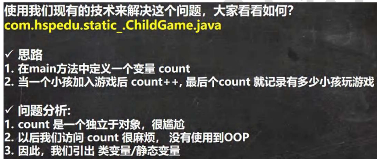
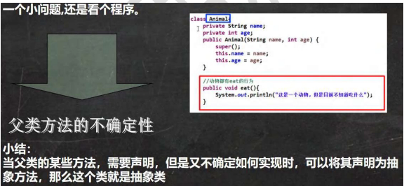

## 一、类变量和类方法 (static关键字)

### 1. 类变量（静态变量）

- ​提出问题​：如何统计所有对象共享的一个数据？（如：统计玩游戏的小孩总数）
- ​传统方法的局限​：在main方法中定义计数变量，不面向对象，访问麻烦。
​
- ​解决方案​：使用​类变量​。
    - ​定义语法​：访问修饰符 static 数据类型 变量名; (推荐)
    - ​特点​：
        1. 被该类的​所有对象实例共享​。
        2. 在类加载时就初始化生成。
        3. 生命周期随类的加载而开始，随类的消亡而销毁。
    - ​访问方式​：
        - 类名.类变量名 (推荐)
        - 对象名.类变量名
    - ​内存布局​：static变量是对象共享的（具体位置与JDK版本有关，可能在堆或方法区，共识是共享的）。
### 2. 类方法（静态方法）

- ​定义语法​：访问修饰符 static 返回类型 方法名() { }
- ​调用方式​：类名.类方法名 或 对象名.类方法名。
- ​经典使用场景​：工具类方法（如Math、Arrays中的方法）。​当方法中不涉及任何和对象相关的成员时​，可设计为静态方法，提高效率。
- ​注意事项与细节​：
    1. 类方法和普通方法都随类加载而加载，结构信息存储在方法区。
    2. 类方法中无this参数​；普通方法中隐含着this参数​。
    3. ​核心口诀​：​静态方法只能访问静态成员（静态变量、静态方法）​。普通成员方法既可以访问非静态成员，也可以访问静态成员。
    4. 类方法中**不能使用this和super**关键字。
    5. 静态方法可以通过类名调用；普通方法必须通过对象名调用。

## 二、理解main方法语法

- public static void main(String[] args) {}
- ​深入理解​：
    1. main方法由Java虚拟机(JVM)调用。
    2. public: JVM需要调用，访问权限必须公开。
    3. static: JVM调用时不必创建对象。
    4. void: 无返回值给JVM。
    5. String[] args: 接收命令行参数。
- 在main方法中的访问规则​：
    1. 可以直接访问本类的​静态成员​。
    2. 不能直接访问本类的​非静态成员​，必须创建对象后通过对象访问。
## 三、代码块

- ​基本介绍​：属于类的成员，类似于方法，将逻辑语句封装在{}中。没有方法名、返回、参数，在加载类或创建对象时​隐式调用​。
- ​基本语法​：
```java
[修饰符] {
    // 逻辑语句
};
```
- ​好处​：是对构造器的补充，可将多个构造器中的重复语句抽取到初始化块中，提高代码重用性。
- ​使用细节与执行顺序（非常重要！）​：
    1. ​静态代码块​：在类加载时执行，且​只执行一次​。可以初始化静态属性。
    2. ​普通代码块​：在每次创建对象时执行，在构造器之前执行。
    3. ​执行顺序（继承关系下）​：
        - 父类静态代码块 -> 子类静态代码块 -> 父类普通代码块 -> 父类构造器 -> 子类普通代码块 -> 子类构造器。
    4. 普通代码块只能直接调用本类的静态成员，不能调用非静态成员（因为此时对象可能还未完全初始化）。
## 四、单例设计模式

- ​设计模式​：在大量实践中总结出的优选代码结构、编程风格和解决问题的思考方式。
- ​单例模式​：保证在整个软件系统中，对某个类​只能存在一个对象实例​，并提供一个获取该实例的全局访问点。
- ​实现步骤​：
    1. 构造器私有化（防止外部new）。
    2. 类的内部创建对象。
    3. 向外暴露一个公共的静态方法 (getInstance) 来获取该对象。
- ​两种实现方式​：
    - ​饿汉式​：类加载时就创建对象实例。
        - ​优点​：线程安全（天然）。
        - ​缺点​：可能造成资源浪费（如果实例一直未被使用）。
    - ​懒汉式​：使用时才创建对象实例。
        - ​优点​：避免资源浪费。
        - ​缺点​：存在线程安全问题（后续线程部分解决）。
- ​应用实例​：java.lang.Runtime 是经典的单例模式。
## 五、final关键字

- ​含义​：最终的。可以修饰类、属性、方法和局部变量。
- ​使用场景​：
    1. ​修饰类​：该类​不能被继承​（如String类）。
    2. ​修饰方法​：该方法​不能被重写/覆盖​。
    3. ​修饰属性​：该属性变为​常量​，值必须初始化且之后不能修改。
    4. ​修饰局部变量​：该局部变量值不能修改。
- ​使用细节​：
    1. final修饰的属性（常量）命名一般用XX_XX_XX（大写+下划线）。
    2. final属性​必须赋初值​，赋值位置可选：
        - 定义时。
        - 在构造器中。
        - 在代码块中。
    3. 如果final修饰的属性是静态的，则初始化位置只能是：
        - 定义时。
        - 在静态代码块中。（​不能在构造器中​）
    4. final类不能继承，但可以实例化对象。
    5. 含有final方法的非final类，该方法可以被继承，但不能被重写。
## 六、抽象类

- ​提出问题​：父类方法需要声明，但无法确定具体实现（如Animal的eat方法）。
​
- ​解决之道​：使用abstract关键字。
    - abstract修饰类 -> ​抽象类​。
    - abstract修饰方法 -> ​抽象方法​（没有方法体）。
- ​介绍​：抽象类的价值更多在于​设计​，让子类继承并实现其抽象方法。是框架和设计模式中常用的知识点。
- ​注意事项与细节​：
    1. ​抽象类不能被实例化​。
    2. 抽象类不一定包含abstract方法​。但一旦包含abstract方法，该类必须声明为abstract。
    3. abstract只能修饰类和方法，不能修饰属性和其他。
    4. 抽象类本质还是类，可以有任意成员（属性、方法、构造器、代码块等）。
    5. 如果一个类继承了抽象类，则它必须实现父类的所有抽象方法，除非它自己也声明为abstract类。
    6. ​抽象方法不能使用private、final和static修饰​，因为这些关键字与重写相违背。
## 七、抽象类最佳实践——模板设计模式

- ​介绍​：抽象类体现了一种模板模式设计，作为多个子类的通用模板。子类在抽象类基础上扩展，但总体上保留抽象类的行为方式。
- ​解决问题​：当功能内部一部分实现是确定的，一部分不确定时。将不确定的部分暴露为抽象方法，让子类实现。
- ​最佳实践案例​：统计不同任务执行的时间。
    - 在抽象父类 (Template) 中，定义计算时间的通用方法 (calculateTime)。
    - 将具体任务 (job) 声明为抽象方法，由子类实现。
    - 这样既统一了计时逻辑，又保留了子类任务的灵活性。
## 八、接口 (interface)

- ​为什么有接口​：实现统一规范，解决高内聚低耦合的设计需求（类似于现实中的USB接口）。
- ​快速入门​：接口是更加抽象的抽象类。在JDK7.0及以前，接口中所有方法都是抽象方法（没有方法体）。JDK8.0后，接口可以有静态方法、默认方法（有具体实现）。
- ​基本语法​：
```java
interface 接口名 {
    // 属性 (默认 public static final)
    // 方法 (默认 public abstract)
}
class 类名 implements 接口 {
    // 必须实现接口的所有抽象方法
}
```
核心定义
- 本质：一种行为规范（契约），定义了一组方法签名，但不包含具体实现（Java 8 之前）。
- 实例化：不能被实例化（new​），不能有构造函数。
- 继承关系：类通过 implements​ 实现接口；接口通过 extends​ 继承其他接口（支持多重继承）。
成员规则速查表

| 成员类型 | 默认修饰符                 | 关键限制         | 备注                                    |
| :--- | :-------------------- | :----------- | :------------------------------------ |
| 变量   | ​public static final​ | 必须是常量，声明即初始化 | 无法在实现类中修改                             |
| 抽象方法 | ​public abstract​     | 实现类必须重写      | 核心契约                                  |
| 默认方法 | ​default​(Java 8+)    | 可有具体实现，可被重写  | 解决多继承冲突需显式调用Interface.super.method()​ |
| 静态方法 | ​static​(Java 8+)     | 不可被继承或重写     | 只能通过接口名.方法()​调用                       |
| 私有方法 | ​private​(Java 9+)    | 仅接口内部可见      | 用于 default/static 方法的代码复用             |

### 三大关键陷阱与细节

1. 多继承冲突
    场景：类实现了两个接口，且这两个接口有同名的 default 方法。
    结果：编译报错。
    解决：实现类必须重写该方法，并使用 InterfaceName.super.methodName() 指定调用哪一个父接口的逻辑。
    优先级规则：抽象方法 > 默认方法。如果一个是抽象方法，一个是默认方法，实现类必须实现抽象方法（默认方法自动失效）。
2. 访问权限控制
    ​对外​：接口中的抽象方法和默认方法本质上都是 public​。
3. 重写规则：实现类在重写接口方法时，必须使用 public​ 修饰符，不能降低访问权限（如改为 protected或private）。
4. 函数式接口 (Functional Interface)
    ​定义​：只包含一个抽象方法的接口。
    ​用途​：Lambda 表达式的基础。
5. 注解：推荐加上 @FunctionalInterface​，编译器会检查是否只有一个抽象方法（允许有多个 default/static 方法）。

### 最佳实践建议

1. ​接口隔离​：保持接口小而专一，避免“胖接口”。
2. ​向后兼容​：升级旧接口时，优先使用 default​ 方法添加新功能，避免破坏现有实现类。
3. ​代码复用​：如果多个接口需要共享逻辑，优先考虑抽象类；如果必须用接口，利用 Java 9 的 private​ 方法在接口内部提取公共逻辑。
4. ​常量管理​：虽然接口可以定义常量，但不要把接口当作纯粹的常量容器（Constant Interface 反模式），建议使用类或枚举来管理常量。

## 九、内部类

### 1. 局部内部类

- 定义：定义在方法体、构造器或代码块内部。
- 特点：
    1. 可以直接访问外部类的所有成员（包含私有）。
    2. 不能使用访问修饰符（public/private）或 static​（地位如同局部变量），但可用final修饰。
    3. 作用域仅限当前代码块，外部不可见。
    4. 外部其他类不能访问局部内部类。
    5. 如果外部类和内部类成员重名，默认就近原则，访问外部类成员用外部类名.this.成员。
    6. ​访问局部变量限制​：只能访问 final​ 或 ​effectively final​（初始化后未修改）的局部变量。
        - 原理：生命周期不一致（栈 vs 堆），Java 通过值复制实现闭包。
- ​适用场景​：逻辑仅在当前方法内使用，避免污染类结构。
### 2. 匿名内部类（极其重要！）

定义：没有类名的内部类，定义即实例化。
本质：同时是一个类、一个对象。
特点：
- 本质是局部内部类的特例。
- 必须继承一个父类或实现一个接口。
- 不能定义构造函数（无名），不能定义静态成员。
- ​this​ 指向匿名类实例本身。
​语法​：
```java
new 类/接口 (参数列表) {
    // 类体（重写方法或实现方法）
};
```
​现代替代​：若是函数式接口，优先使用 ​Lambda 表达式​。
### 3. 成员内部类

- 定义：位于外部类内部，与成员变量同级，无 static​ 修饰。
- ​特点​：
    1. 可访问外部类所有成员（含私有）
    2. 不能定义静态成员（static final​ 常量除外）。
    3. 隐式持有外部类实例引用 (Outer.this​)。
    4. ​可以添加任意访问修饰符​（地位是一个成员）。
    5. 作用域为整个类体。
    6. 外部其他类访问成员内部类：
        - 外部类.内部类 引用 = 外部类对象.new 内部类();
        - 通过外部类提供的返回内部类对象的方法。

实例化语法：
```markdown
Outer outer = new Outer();
Outer.Inner inner = outer.new Inner(); // 必须依赖外部类实例
```
访问同名成员：
```markdown
Outer.this.variableName; // 显式访问外部类成员
```
### 4. 静态内部类
- 定义：位于外部类内部，使用 static​ 修饰。
- ​特点​：
    1. 可以直接访问外部类的所有静态成员（含私有），不能直接访问非静态成员。
    2. 可以定义静态成员。
    3. 独立于外部类存在。
    4. 不持有外部类实例引用（节省内存，防泄漏）。
    5. 可以添加任意访问修饰符。
    6. 作用域为整个类体。
    7. 外部其他类访问静态内部类：
        - 外部类.内部类 引用 = new 外部类.内部类(); （通过类名直接访问）
        - 通过外部类提供的返回静态内部类对象的方法。
实例化语法：
```markdown
Outer.StaticInner inner = new Outer.StaticInner(); // 直接 new
```
- ​典型应用​：
    - ​单例模式​（静态内部类单例，线程安全且懒加载）。
    - 工具类嵌套。
### 核心对比速查表

|特性|成员内部类|静态内部类|局部内部类|匿名内部类|
|:--|:--|:--|:--|:--|
|static 修饰|❌|✅|❌|❌|
|外部类实例依赖|必须|不需要|视情况 (访问非静态需依赖)|视情况|
|访问外部私有成员|✅|仅静态成员|✅|✅|
|访问局部变量|N/A|N/A|仅 final/effectively final|仅 final/effectively final|
|定义静态成员|❌ (除常量)|✅|❌|❌|
|访问修饰符|public/private等|public/private等|无|无|
|主要用途|强耦合业务逻辑|解耦工具/单例|临时逻辑封装|一次性回调/监听|

### Lambda vs 匿名内部类

- ​推荐​：Java 8+ 实现函数式接口时，​首选 Lambda​。
- ​区别​：
    - Lambda 更简洁，编译器优化更好（复用 class 文件）。
    - ​this​ 指向不同：Lambda 的 this​ 指向​外部类​；匿名内部类的 this​ 指向​内部类​。