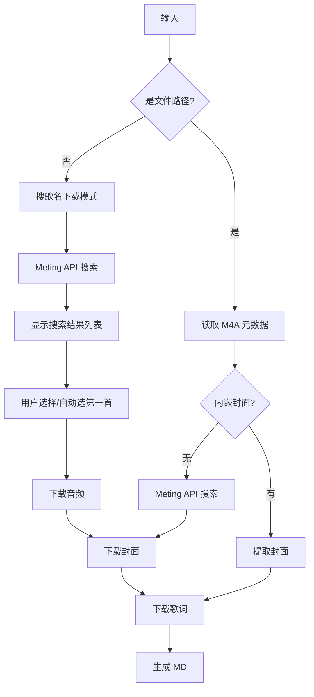

# M4A 音乐自动提取歌词与封面教程

## 背景

博客的音乐收藏页面（`/music`）需要为每首歌准备三样东西：

| 文件 | 用途 |
|------|------|
| `.m4a` / `.mp3` | 音频文件本身 |
| `.lrc` | 同步歌词（带时间轴的歌词文件） |
| `.jpg` | 专辑封面图 |
| `.md` | 博客的 Markdown 内容文件 |

手动搜歌词、下载封面、写 md 实在太麻烦。我写了一套脚本，**两种方式**一条命令全部搞定。

---

## 两种使用模式

脚本 `fetch-lrc.py` 支持两种模式：

| 模式 | 使用场景 | 命令 |
|------|----------|------|
| 本地文件模式 | 已有 M4A 文件，提取内嵌封面+API 下载歌词 | `python fetch-lrc.py song.m4a --md` |
| 搜索下载模式 | 没有本地文件，直接搜歌名下载音频+封面+歌词 | `python fetch-lrc.py "晴天" "周杰伦" --md` |

---

## 工作原理



1. **本地文件模式**：读取 M4A 元数据（歌名、歌手）→ 提取内嵌封面 → API 搜索 → 下载歌词 → 生成 md
2. **搜索下载模式**：输入歌名搜索 → 选择结果 → 下载音频 → 下载封面 → 下载歌词 → 生成 md

---

## 环境准备

### 安装依赖

需要 Python 3 和 mutagen 库：

```bash
pip install mutagen
```

> 注意：Windows 上可能有多个 Python 版本，确保用装过 mutagen 的那个。可以用完整路径指定，如 `C:/Users/xxx/AppData/Local/Programs/Python/Python313/python.exe`

无需 ffmpeg，纯 Python 实现。

---

## 使用方法

### 本地文件模式

```bash
# 处理单个文件
python scripts/fetch-lrc.py "path/to/song.m4a" --md

# 处理整个目录（批量）
python scripts/fetch-lrc.py "path/to/music/folder" --md
```

脚本会遍历目录下所有 `.m4a`、`.mp3`、`.flac` 等文件，逐个提取封面和下载歌词。

### 搜索下载模式

```bash
# 只搜歌名
python scripts/fetch-lrc.py "晴天" --md

# 歌名 + 歌手（提高准确度）
python scripts/fetch-lrc.py "海阔天空" "Beyond" --md

# 换平台
python scripts/fetch-lrc.py "起风了" --md --server=kugou

# 指定下载目录
python scripts/fetch-lrc.py "晴天" "周杰伦" --md --out=./downloads

# 只搜索预览（不下载）
python scripts/fetch-lrc.py "晴天" --dry-run
```

搜索结果有多条时会显示列表，交互模式下可手动选择序号，非交互终端自动选第一首。

### 完整参数表

| 参数 | 说明 | 默认值 |
|------|------|--------|
| 第一个参数 | M4A 文件路径 / 歌名 | 必填 |
| 第二个参数 | 歌手名（搜索模式） | 空 |
| `--md` | 生成博客 md 文件到 `src/content/bangumi/music/` | 关闭 |
| `--no-md` | 只提取/下载，不生成 md | - |
| `--server=xxx` | 音乐平台 | `netease` |
| `--audio-base=xxx` | 自定义 URL 前缀 | `https://ph.0824.uk/file/music/` |
| `--md-dir=xxx` | 自定义 md 输出目录 | `src/content/bangumi/music/` |
| `--out=xxx` | 搜索模式的下载目录 | `scripts/downloads/` |
| `--dry-run` | 搜索模式只预览，不下载 | - |

### 支持的平台

| 值 | 平台 |
|------|------|
| `netease` | 网易云音乐 |
| `tencent` | QQ 音乐 |
| `kugou` | 酷狗音乐 |
| `baidu` | 百度音乐 |
| `kuwo` | 酷我音乐 |

---

## 实操示例：本地文件模式

以歌曲《暗恋过结局呢》为例。

### 第一步：准备 M4A 文件

将 M4A 文件放到任意目录，例如 `scripts/zcyyy/`：

```
scripts/zcyyy/
└── 暗恋过结局呢.m4a
```

### 第二步：运行脚本

```bash
python scripts/fetch-lrc.py scripts/zcyyy --md
```

### 第三步：查看输出

```
scripts/zcyyy/
├── 暗恋过结局呢.m4a    ← 原始文件
├── 暗恋过结局呢.lrc    ← API 下载的同步歌词
└── 暗恋过结局呢.jpg    ← API 下载的封面图

src/content/bangumi/music/
└── 暗恋过 结局呢.md    ← 自动生成的博客内容文件
```

---

## 实操示例：搜索下载模式

以歌曲《知我》为例。

### 第一步：运行命令

```bash
python scripts/fetch-lrc.py "知我" "哦漏" --md
```

### 第二步：选择结果

```
搜索: 知我 - 哦漏

搜索结果:

  [ 1] 知我 - 国风堂 / 哦漏
  [ 2] 知我 (伴奏) - 国风堂 / 哦漏
  ...

选择序号 (1-2, 默认 1): 1

选中: 知我 - 国风堂 / 哦漏
  音频 [100%] =========================> 11 MB/11 MB
  [封面] 知我-国风堂哦漏.jpg
  [歌词] 知我-国风堂哦漏.lrc (1950 字符)
  [MD] 知我.md
```

### 第三步：输出文件

```
scripts/downloads/
├── 知我-国风堂哦漏.m4a    ← 下载的音频
├── 知我-国风堂哦漏.jpg    ← 封面图
└── 知我-国风堂哦漏.lrc    ← 同步歌词

src/content/bangumi/music/
└── 知我.md               ← 自动生成的博客内容文件
```

---

## 生成的 Markdown 格式

```markdown
---
title: 知我
category: music
status: 2
image: https://ph.0824.uk/file/music/知我-国风堂哦漏.jpg
artist: 国风堂 / 哦漏
audioUrl: https://ph.0824.uk/file/music/知我-国风堂哦漏.m4a
lrcUrl: https://ph.0824.uk/file/music/知我-国风堂哦漏.lrc
score: 0
published: 2026-05-16
---
```

生成后手动调整 `score`（评分）、`status`（状态）、`title`（清理多余空格）即可。

**状态码含义：**

| 值 | 含义 |
|----|------|
| `1` | 想听 |
| `2` | 听过 |
| `3` | 在听 |
| `4` | 搁置 |
| `5` | 弃了 |

---

## 批量处理

```bash
# 批量处理本地 M4A 文件
python scripts/fetch-lrc.py D:/Music/ --md

# 批量下载歌单（需提前准备好歌名列表，自行写批处理循环）
```

已处理的文件会自动跳过（封面、歌词、md 已存在则不再重复生成）。如需重新生成，先删除已有文件即可。

---

## 常见问题

### Q: 歌词下载失败？

换个平台试试：

```bash
python scripts/fetch-lrc.py song.m4a --md --server=kugou
```

### Q: 搜索下载模式下无法手动选择？

非交互终端（如管道执行）会自动选第一首。手动终端用 PowerShell 或 CMD 打开运行即可交互选择。

### Q: 音频下载失败？

某些热门歌曲因版权限制，Meting API 可能返回 404。尝试换平台搜索：

```bash
python scripts/fetch-lrc.py "晴天" "周杰伦" --md --server=kugou
```

### Q: 封面不对？

本地文件模式优先使用 M4A 内嵌封面。如果内嵌封面不对，删除自动生成的 `.jpg` 后重新运行即可从 API 下载。

### Q: 文件名有空格和特殊符号？

最新版脚本会自动清理文件名中的空格和特殊字符，确保 URL 合法。

### Q: 不想生成 md？

```bash
python scripts/fetch-lrc.py song.m4a --no-md
```

### Q: URL 前缀怎么改？

```bash
python scripts/fetch-lrc.py song.m4a --md --audio-base=https://你的cdn.com/music/
```

### Q: pip install mutagen 后还是报 ModuleNotFoundError？

Windows 上可能有多个 Python 版本。检查方式：

```bash
# 查看当前 python 路径
where python

# 用装过 mutagen 的那个 Python 执行
C:/完整路径/python.exe scripts/fetch-lrc.py ...
```

---

## 总结

| 操作 | 命令 |
|------|------|
| 本地文件 → 歌词+封面 | `python scripts/fetch-lrc.py song.m4a --md` |
| 批量导入本地文件 | `python scripts/fetch-lrc.py ./music-folder/ --md` |
| 直接搜歌下载 | `python scripts/fetch-lrc.py "晴天" "周杰伦" --md` |
| 只要音频+封面+歌词 | `python scripts/fetch-lrc.py "晴天" --no-md` |
| 换个平台搜 | `python scripts/fetch-lrc.py "晴天" --md --server=kugou` |

整个流程只需一条命令，博客音乐收藏页面就自动上线新歌了。
