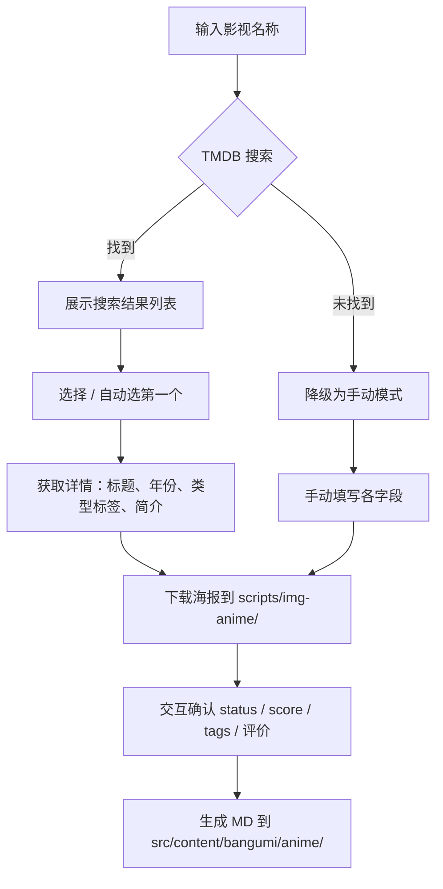

# 影视封面一键下载与博客导入教程

## 背景

博客的影视与游戏页面（`/movies-games`）展示你看过的电影、电视剧和动画。每添加一部作品，需要准备：

| 内容 | 用途 |
|------|------|
| `.jpg` 海报 | 卡片封面图 |
| `.md` | 博客内容文件（含标题、评分、标签、状态等） |

之前得自己去 TMDB 或豆瓣搜海报、下载、手写 frontmatter。现在有了 `fetch-media.py`，一条命令全搞定。

---

## 原理



脚本调用 TMDB API v3（免费无需审核），搜索支持中文，自动获取中文标题、类型标签和海报。

---

## 环境准备

无需安装任何依赖，Python 3 标准库即可运行。

> TMDB API key 已内置在脚本中，开箱即用。**需要开启代理/加速器**才能访问 TMDB。

---

## 使用方法

### 快速模式（推荐）

```bash
# 电影
python scripts/fetch-media.py "星际穿越" -y

# 电视剧
python scripts/fetch-media.py "黑暗荣耀" --type=tv -y

# 动画
python scripts/fetch-media.py "你的名字" --type=anime -y

# 纪录片
python scripts/fetch-media.py "地球脉动" --type=documentary -y
```

`-y` 模式下自动选第一个搜索结果，status 默认设为「看过」，跳过所有确认。

### 交互模式

```bash
python scripts/fetch-media.py "唐人街探案"
```

交互模式下可以：
- 从多个搜索结果中手动选择
- 自定义状态（想看/看过/在看/搁置/抛弃）
- 修改评分 0-10
- 修改标签
- 填写评价

### 预设参数

```bash
# 直接指定状态和评分
python scripts/fetch-media.py "让子弹飞" -y --status=2 --score=9

# 手动模式 + 提供封面 URL
python scripts/fetch-media.py "冷门电影" -y --cover-url=https://xxx.com/poster.jpg
```

### 完整参数表

| 参数 | 说明 | 默认值 |
|------|------|--------|
| 第一个参数 | 影视名称 | 必填 |
| `-y` / `--yes` | 快速模式，自动第一个结果 | 关闭 |
| `--type=xxx` | 指定类型：`movie` / `tv` / `anime` / `documentary` | 自动判断 |
| `--status=x` | 状态：1想看 2看过 3在看 4搁置 5抛弃 | 2 |
| `--score=x` | 评分 0-10 | 0 |
| `--cover-url=xxx` | 手动模式下的封面图 URL | 空 |
| `--api-key=xxx` | TMDB API key（覆盖内置 key） | 内置 key |

---

## 实操示例

### 示例一：搜索到结果（正常流程）

```bash
$ python scripts/fetch-media.py "星际穿越" -y

搜索: 星际穿越

搜索结果:

  [ 1] [电影] 星际穿越 (2014)
       未来的地球黄沙遍野，农作物相继枯萎灭绝。人类不再像从前...
  [ 2] [电影] 走进星际穿越 (2015)
       该纪录片分为14个片段...
  [ 3] [电影] 星际穿越：诺兰的奥德赛 (2014)

快速模式: 自动选择第 1 个

获取详情...

==================================================
  标题: 星际穿越
  原名: Interstellar
  类型: 电影 → subcategory: movie
  年份: 2014
  标语: 爱是一种力量，能让我们超越时空的维度来感知它的存在
  标签: 冒险, 剧情, 科幻
==================================================

  下载封面: 星际穿越.jpg
  封面 [100%] =========================> 86 KB/86 KB
  [MD] 星际穿越.md

完成: 星际穿越
```

### 示例二：TMDB 搜不到（手动模式）

```bash
$ python scripts/fetch-media.py "写给阿嬷的情书" -y

搜索: 写给阿嬷的情书
  TMDB 未找到结果，切换到手动模式

快速模式: subcategory=movie, status=2(看过), score=0
  封面: [无]
  [MD] 写给阿嬷的情书.md

完成: 写给阿嬷的情书
```

搜不到时自动降级为手动模式，MD 照样生成。后续手动补充封面图即可。

---

## 输出文件

```
scripts/img-anime/
└── 星际穿越.jpg          ← 海报封面（需手动上传 CDN）

src/content/bangumi/anime/
└── 星际穿越.md           ← 博客内容文件
```

### 生成的 Markdown 格式

```markdown
---
title: 星际穿越
name_cn: 星际穿越
category: anime
subcategory: movie
status: 2
image: https://ph.0824.uk/file/anime/星际穿越.jpg
score: 0
tags:
  - 冒险
  - 剧情
  - 科幻
published: 2026-05-18
---
```

- `image` 字段指向 CDN 地址 `https://ph.0824.uk/file/anime/`
- 封面图生成后需手动上传到 CDN 对应路径
- 生成后可手动编辑 md 补充评价、调整评分

### 状态码

| 值 | 含义 |
|----|------|
| `1` | 想看 |
| `2` | 看过 |
| `3` | 在看 |
| `4` | 搁置 |
| `5` | 抛弃 |

---

## 封面图上传

脚本下载的海报保存在 `scripts/img-anime/` 目录。需要手动上传到 CDN 的 `https://ph.0824.uk/file/anime/` 路径，文件名保持一致即可。

例如：
1. 脚本生成 `scripts/img-anime/星际穿越.jpg`
2. 上传到 CDN → `https://ph.0824.uk/file/anime/星际穿越.jpg`
3. MD 中的 `image` 字段已自动填写该 URL，无需修改

---

## 常见问题

### Q: 报错 `urlopen error timed out`？

TMDB API 需要代理。开启加速器/代理后再运行。

### Q: 搜不到想要的结果？

TMDB 作为国外数据库，部分华语冷门电影可能未收录。脚本会自动降级为手动模式，不影响 MD 生成。

### Q: 快速模式选错了（如选了网剧而不是电影）？

去掉 `-y` 用交互模式，手动选择正确的搜索结果。

```bash
python scripts/fetch-media.py "唐人街探案"
# → 选择序号: 2  （电影版）
```

### Q: MD 已存在怎么办？

脚本会自动跳过已有 MD 文件，不会覆盖。如需重新生成，先手动删除旧的 MD。

### Q: 想换 CDN 地址？

修改脚本顶部的 `CDN_BASE` 变量即可。

---

## 总结

| 操作 | 命令 |
|------|------|
| 快速添加电影 | `python scripts/fetch-media.py "片名" -y` |
| 添加电视剧 | `python scripts/fetch-media.py "剧名" --type=tv -y` |
| 添加动画 | `python scripts/fetch-media.py "动画名" --type=anime -y` |
| 交互模式手动选择 | `python scripts/fetch-media.py "片名"` |
| 指定评分和状态 | `python scripts/fetch-media.py "片名" -y --score=9 --status=2` |

一条命令，海报 + MD 全部到位，再也不用手动搜图写 frontmatter 了。
