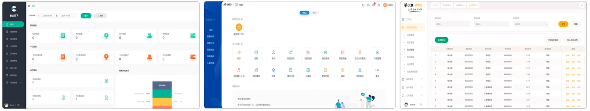
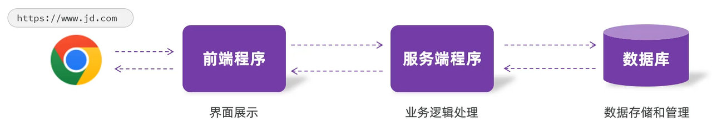

## 1. 什么是Web

**Web**：全球广域网，也称为万维网(www World Wide Web)，说白了，Web指的就是能够通过浏览器访问的网站。&#x20;

是，我们日常生活中，经常使用的像淘宝、京东、唯品会这类的电商网站。

还有像CRM、OA、ERP这类的企业内部的管理系统等等，这些都是Web网站。

要想开发这样一个web网站，那首先就得知道web网站的基本结构。
## 2. Web网站结构

&#x20;一个web网站，核心呢，是由三个部分组成的，分别是：前端程序、后端程序、数据库。 具体的职责为：

* 前端程序：负责将数据以好看的样式呈现出来。

* 后端程序：负责具体的业务逻辑的处理。

* 数据库：负责数据的存储和管理。

具体的请求访问流程为：

* 当我们在浏览器地址栏，输入url地址之后，一敲回车，此时首先访问到的是服务器中部署的前端程序，而前端程序仅仅负责将数据以好看的样式呈现出来，这个数据并不是在前端页面中写死的。

* 所以，此时需要在前端程序中，发送请求来请求服务端程序，服务端程序在查询数据库，然后将数据库查询的数据返回给前端。

* 最终，前端程序再将数据渲染展示在页面中。 而前端程序，浏览器是可以直接解析的，那浏览器解析了前端程序之后，最终就会呈现出一个精美的网页。

## 3. Web开发课程安排

本课程中采用了当前企业开发的主流开发模式：前后端分离开发模式。Web开发课程主要分为6个小的阶段，分别是：

| **阶段**  | **时长** | **内容**                                        |
| ------- | ------ | --------------------------------------------- |
| Web前端基础 | 2天     | HTML、CSS、JS、Vue3、Ajax                         |
| Web后端基础 | 4天     | Maven、HTTP协议、Spring IOC、DI、MySQL、JDBC、Mybatis |
| Web后端实战 | 6天     | Tlias案例（基于案例讲解web开发的核心知识）                     |
| Web后端进阶 | 2天     | SpringAOP、SpringBoot原理、自定义Starter、Maven高级     |
| 前端web实战 | 4天     | Vue工程化、ElementPlus、Tlias案例                    |
| 项目部署    | 2天     | Linux、Docker                                  |

